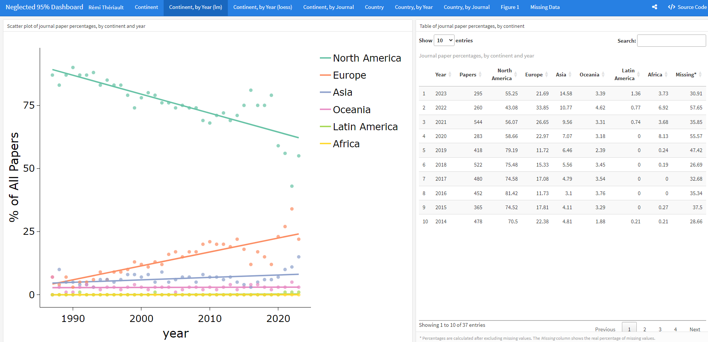
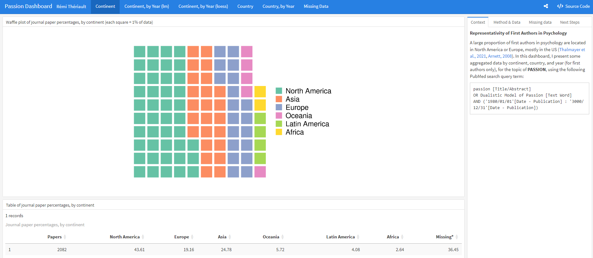

<!-- README.md is generated from README.Rmd. Please edit that file -->

```{r, include = FALSE}
knitr::opts_chunk$set(
  collapse = TRUE,
  comment = "#>",
  fig.path = "man/figures/README-",
  out.width = "100%"
)
```

# pubmedDashboard: Creating PubMed Data Visualization Dashboards 

<!-- badges: start -->
[](https://lifecycle.r-lib.org/articles/stages.html#experimental)
[](https://CRAN.R-project.org/package=pubmedDashboard)
<!-- badges: end -->

The goal of `pubmedDashboard` is to facilitate the creation of pretty data visualization dashboards using the `flexdashboard` and `easyPubMed` packages.

## Installation

You can install the development version of `pubmedDashboard` like so:

``` r
# If `remotes` isn't installed, use `install.packages("remotes")`
remotes::install_github("rempsyc/pubmedDashboard")
```

## Basic Examples

`pubmedDashboard` helps parse the address to identify department and university of affiliation, as well as country.

```{r, warning=FALSE}
library(pubmedDashboard)

address <- c("Department of Psychology, Cornell University, Ithaca, New York 14853-7601.",
             "Dipartimento di Psicologia Generale, Università di Padova, Italy.",
             "Universität Mannheim, Federal Republic of Germany.",
             "Département de psychologie, Université du Québec à Montréal, Canada.")

get_affiliation(address, "department")

get_affiliation(address, "university")

get_country(address)

```

## Mega Function

One simple function allows to download the paper data from PubMed, convert the XLM data to a dataframe, extract affiliations, match universities to countries, identify countries and continents, and save the file to disk for later reuse.

```{r example, warning=FALSE}
pubmed_query_string <- paste(
  "passion [Title/Abstract]",
  "AND Dualistic Model of Passion [Text Word]")

save_process_pubmed_batch(
  pubmed_query_string,
  year_low = 2023,
  year_high = 2030)

```

## Example Dashboards

### Neglected 95% Dashboard

[](https://remi-theriault.com/dashboards/neglected_95)

### Passion Dashboard

[](https://remi-theriault.com/dashboards/passion)
